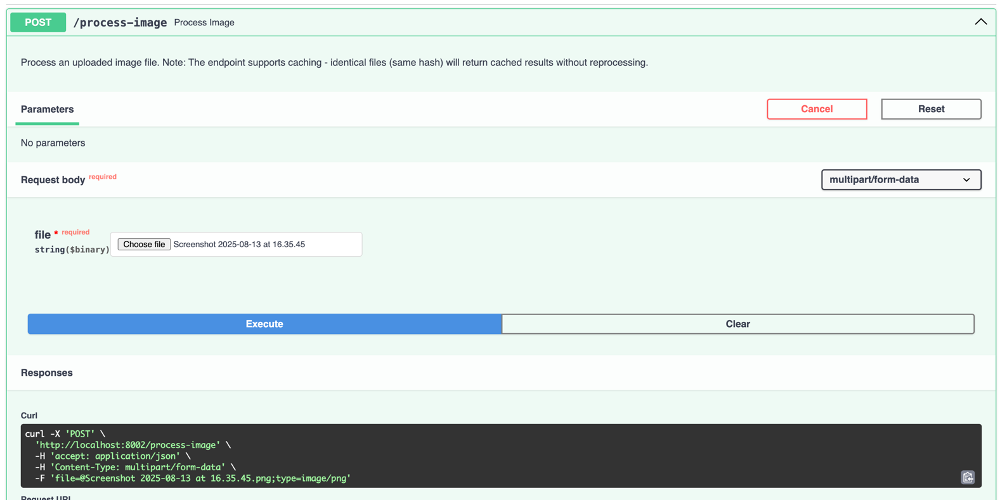
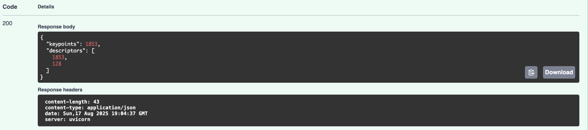
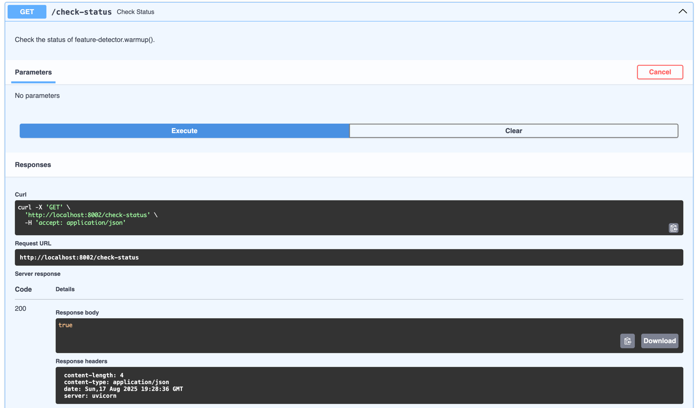

# Image Processing Service

A FastAPI-based image processing service with feature detection capabilities, built with Docker and PostgreSQL.

## Features

- 🖼️ Image upload and processing
- 🔍 Feature detection using OpenCV
- 📊 Request/response logging
- 🗄️ PostgreSQL database integration
- 🐳 Containerized with Docker
- 🚀 Automatic database table creation
- 📝 Comprehensive API documentation

## Prerequisites

- Docker and Docker Compose installed ()
- Git (for cloning the repository)

## Quick Start

### 1. Clone the Repository

```bash
git clone git@github.com:NastiaFasova/feature-detector.git
cd feature_detector
```

### 2. Environment Configuration

You may see, that I left .env file for testing purposes. If you're willing to create your own database,
please change .env file, so that it contains parameters with credentials to your recently created db

Feel free to use sql query below:
```sql
CREATE DATABASE <db_name>;
```

More information can be found here:
https://www.postgresql.org/docs/current/manage-ag-createdb.html


### 3. Run the Service

```bash
# Start all services
Open Docker Desktop (to start docker daemon)
docker-compose up --build
```

### 4. Verify Installation

- **SWAGGER Documentation**: http://localhost:8002/docs#/

## API Endpoints

### Process Image
- **URL**: `POST /process-image`
- **Description**: Upload and process an image file
- **Content-Type**: `multipart/form-data`
- **Parameters**: 
  - `file`: Image file (JPG, PNG, etc.)

#### Testing example
After opening http://localhost:8002/docs#/ , feel free to test both endpoints simultaneously






## Project Structure

```
├── app/
│   ├── core/
│   │   ├── config.py          # Application configuration
│   │   └── database.py        # Database setup
│   ├── middleware/
│   │   └── logging.py         # Request/response logging
│   ├── models/
│   │   └── log_request_model.py     # Database models
│   ├── repositories/
│   │   └── repositories.py    # Data access layer
│   ├── routes/
│   │   └── routes.py          # API endpoints
│   ├── services/
│   │   ├── logging_service.py # Logging business logic
│   │   └── process_image_service.py # Image processing logic
│   └── utils/
│       ├── feature_detector.py        # OpenCV feature detection
│       ├── feature_detector_manager.py # Detector singleton
│       └── file_hash.py               # File hashing utilities
│       └── request_analyze_helper.py  # File hashing utilities
├── docker-compose.yml
├── Dockerfile
├── requirements.txt
├── .env                       # Environment variables
└── README.md
```

## Development

```

### Accessing the Database

```bash
# Connect to PostgreSQL
docker-compose exec db psql -U user -d feature_detector_db

# Common SQL commands
\dt                              # List tables
SELECT * FROM log_requests;      # View logs
\q                               # Quit
```

### Viewing Logs

```bash
# View all logs
docker-compose logs

# Follow logs in real-time
docker-compose logs -f

# View specific service logs
docker-compose logs -f fastapi
docker-compose logs -f db
```

## Configuration

### Supported Image Formats

- JPEG (.jpg, .jpeg)
- PNG (.png)

### Reset Everything

```bash
# Stop and remove all containers, networks, and volumes
docker-compose down -v

# Remove images
docker-compose down --rmi all

# Rebuild from scratch
docker-compose up --build
```
